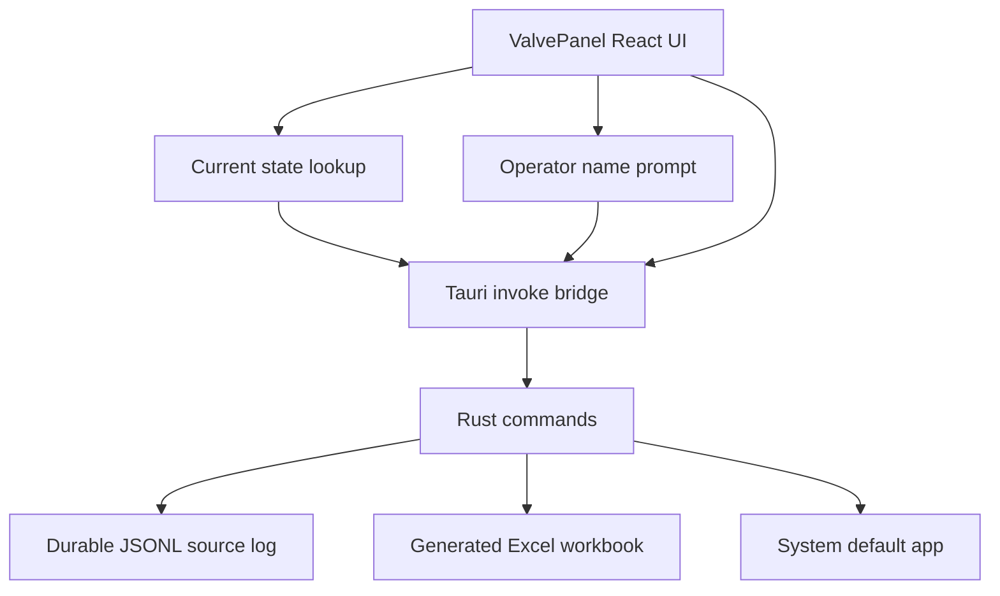

# Architecture

## Overview

A small Tauri desktop app with a React operator panel for manually logging main nitrogen valve open/close events. The UI is modeled on the PDU Data Automation operator panel: dark background, one large state-colored primary action, minimal chrome, and a PDU-style operator-name prompt.

This app does not control or read physical valve hardware yet. Displayed state comes from the latest saved manual JSONL log entry. If no valid log entry exists, the displayed state is an operator-facing assumption that the valve is open.



## Stack

| Layer | Choice | Notes |
|-------|--------|-------|
| Shell | Tauri 2 | Window management and native command bridge |
| Backend | Rust | Manual log commands, timestamping, JSONL append, Excel generation |
| UI | React 19 + TypeScript | Feature-based folder layout |
| Bundler | Vite 8 | Root config in `frontend/vite.config.ts` |
| CSS | Tailwind v4 | Via `@tailwindcss/vite` plugin |
| Package manager | Bun 1.3.14 | `bun.lock` at repo root |
| Excel output | `rust_xlsxwriter` | Regenerates the workbook from JSONL |

## Design System (from PDU)

Defined in `frontend/src/features/valve-panel/stateStyles.ts` and `frontend/src/app/index.css`.

| Token | Value | Usage |
|-------|-------|-------|
| Shell background | `#20201f` | Main panel background |
| Panel surface | `#292928` | Operator prompt |
| Input surface | `#1f1f1e` | Operator-name input |
| Latest open / close action | `#1d7f47` | Close Valve button and confirm button |
| Latest closed / open action | `#343434` | Open Valve button |
| Border | `#454542` | Inputs, panels |
| Muted text | `#d8d2c8` | Status line |
| Focus ring | `cyan-200/25` | Keyboard focus |
| Active ring | `cyan-200/65` | Active button press |

Typography: Segoe UI (with system fallbacks). Buttons use `rounded-md`, `shadow-sm`, bold labels.

Window defaults (`backend/tauri.conf.json`):

- Title: `Nitrogen Valve`
- Size: 360x500
- Min: 360x400
- Centered on launch

## Frontend Architecture

```text
App.tsx
  -> ValvePanel.tsx
       -> PrimaryValveButton
       -> PDU-style operator prompt
       -> operatorNames.ts
       -> valveLog.ts invoke wrappers
```

- `ValvePanel` calls `getCurrentValveState()` on launch and sets `valveState` from the latest valid JSONL entry.
- If no valid entry exists, the backend returns `state: "open"` with `assumed: true`.
- When `valveState` is `"open"`, the primary button is **Close Valve**.
- When `valveState` is `"closed"`, the primary button is **Open Valve**.
- `valveState` changes only after the backend confirms a durable manual event, or after the backend reports that the JSONL event was saved but Excel refresh failed.
- Saved operator names live in localStorage under `nitrogenValve.operatorNames`.
- Operator-name helpers normalize values, trim blanks, prevent case-insensitive duplicates, and sort matching dropdown results with starts-with matches first.
- Frontend filesystem writes are avoided; open/close events go through Rust commands.

## Backend Architecture

`backend/src/lib.rs` registers these Tauri commands:

- `log_valve_closed`
- `log_valve_opened`
- `get_current_valve_state`
- `open_valve_log`

`backend/src/commands.rs` maps Tauri command calls into `backend/src/valve_log.rs`.

`backend/src/valve_log.rs` owns:

- operator-name trim/blank validation
- Documents log path resolution through Tauri path APIs
- current-state lookup from the latest valid JSONL entry
- open/close transition validation
- log directory creation
- JSONL append
- Excel workbook regeneration from all JSONL source entries
- opening the workbook with the system default app
- structured operator-facing error DTOs

The backend records each manual open/close event with:

- local timestamp
- valve name
- action
- previous state
- new state
- operator name
- source `Manual`
- notes

Valid manual transitions:

| Action | Required latest state | Previous State | New State |
|--------|------------------------|----------------|-----------|
| Close Valve | Open | Open | Closed |
| Open Valve | Closed | Closed | Open |

No log file is treated as assumed open, so **Close Valve** is allowed and **Open Valve** is rejected.

## Storage

Default directory:

```text
%USERPROFILE%\Documents\Main Nitrogen Valve Log\
```

Source log:

```text
Main Nitrogen Valve Log.jsonl
```

Excel workbook:

```text
Main Nitrogen Valve Log.xlsx
```

JSONL is the durable source. The Excel workbook is regenerated from JSONL so the operator-facing workbook can be rebuilt after an Excel lock or failed refresh.

Workbook sheet: `Valve Log`

Workbook columns (operator-facing only):

| Header | Source |
|--------|--------|
| Timestamp | `logged_at_local` |
| Valve | `valve` |
| Action | `Closed Valve` or `Opened Valve` (legacy JSONL rows with `Close Valve` / `Open Valve` are normalized on export) |
| Operator | `operator_name` |

Excel formatting: dark header row, alternating row shading, colored action text, frozen header, autofilter.

Internal JSONL entries still keep `previous_state`, `new_state`, `source`, and `notes` for transition logic, but those fields are not exported to Excel.

## Error Handling

The backend returns structured errors with a short code, message, optional detail, and whether the event was already saved.

Important cases:

- `blank_operator_name` - no event is written.
- `source_log_write_failed` - no event is written.
- `invalid_transition` - duplicate or stale open/close attempt; no event is written.
- `shared_sync_failed` during connected-mode logging - no local event is written unless the shared event and shared state were committed first.
- `local_log_write_failed` during connected-mode logging - shared sync already saved the event, but this PC's local JSONL cache could not be updated; the frontend can still update from the saved shared event.
- `excel_refresh_failed` during open/close - JSONL may already be saved; the frontend updates the displayed state when the backend includes the saved entry.
- `excel_refresh_failed` during Open Log - close Excel and retry.
- `open_log_failed` - workbook refresh succeeded but the system default app could not open it.

## Build Pipeline

**Development**

1. `bun run desktop` starts Tauri dev mode in `backend/`.
2. `beforeDevCommand` runs `bun run dev` and serves Vite on `http://localhost:5173`.
3. Tauri loads the dev URL into the native window.

**Production**

1. `beforeBuildCommand` runs `bun run build`.
2. Vite writes `frontend/dist/`.
3. Tauri bundles Rust plus static frontend into the NSIS installer.

## Future Hardware Handoff

When automated valve integration is added, keep the current log format stable if possible:

- `Manual` for this temporary open/close operator workflow
- `Automated` for confirmed hardware-driven close events
- `Hardware Poll` if future state polling records observations

The future version should replace assumed open/closed UI state with backend-confirmed hardware state.
